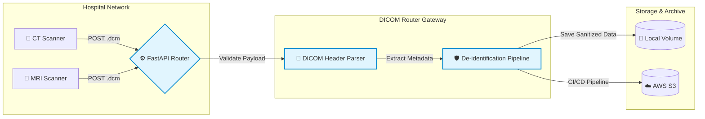

# 🏥 DICOM Router Gateway


## 📌 Overview
**DICOM Router** is a lightweight, production-ready backend microservice designed for automated medical imaging data ingestion and distribution. 

In a clinical environment, hospitals generate massive volumes of DICOM files across various modalities (CT, MRI, X-Ray). This gateway acts as a smart ingress node: it securely receives raw DICOM files via a RESTful API, parses the internal metadata using `pydicom`, and dynamically routes the files into categorized storage based on their imaging `Modality`. 

This project bridges the gap between raw clinical data and downstream AI pipelines, demonstrating a strong focus on **Healthcare IT standards**, **API design**, and **Cloud-native architecture**.

## 🚀 Key Features
*   **Automated Modality Routing**: Extracts DICOM tags (e.g., `(0008, 0060) Modality`) and automatically archives scans into isolated directories (e.g., `/data/CT/`, `/data/MR/`).
*   **High-Performance REST API**: Built with **FastAPI** for asynchronous handling, robust data validation, and self-documenting endpoints (OpenAPI/Swagger).
*   **Data Integrity & Validation**: Rejects invalid file formats and ensures only structurally sound DICOM files enter the storage pipeline.
*   **Containerized Environment**: Fully containerized using **Docker**, ensuring isolated and reproducible deployments across any cloud or local environment.
*   **Quality Mindset**: Test coverage implemented via `pytest` to guarantee routing reliability and error handling.

## 🏗️ Architecture & Workflow



1.  **Ingress**: Client (e.g., a simulated PACS node) POSTs a `.dcm` file to `/api/router/upload`.
2.  **Processing**: The FastAPI router validates the payload and reads the DICOM header.
3.  **Routing**: The system sanitizes the file path and saves the data to the corresponding local or cloud-mounted volume.

## 💻 Getting Started

### Prerequisites
*   Docker & Docker Compose (Recommended)
*   *Or* Python 3.10+ (for local development)

### Option A: Run with Docker (Production-like)
```bash
# 1. Build the Docker image
docker build -t dicom-router-gateway .

# 2. Run the container (maps local port 8000 and data volume)
docker run -p 8000:8000 -v $(pwd)/data:/app/data dicom-router-gateway
```

### Option B: Local Development Setup
```bash
# 1. Create and activate virtual environment
python3 -m venv .venv
source .venv/bin/activate

# 2. Install dependencies
pip install -r requirements.txt

# 3. Start the FastAPI server
uvicorn main:app --reload
```
## 📖 API Documentation
Once the server is running, the interactive Swagger UI is automatically available at:
👉 http://localhost:8000/docs


## Example API Request (cURL)
```bash
curl -X 'POST' \
  'http://localhost:8000/api/router/upload' \
  -H 'accept: application/json' \
  -H 'Content-Type: multipart/form-data' \
  -F 'file=@dummy_scan.dcm;type=application/dicom'
```

## 🛣️ Future Roadmap (Next Steps)
To further align with enterprise HealthTech standards, the following features are planned:
- [ ] **AWS S3 Integration:** Replace local disk storage with AWS S3 buckets utilizing `boto3` for scalable cloud archiving.
- [ ] **De-identification Pipeline:** Implement automated PHI (Protected Health Information) stripping to ensure strict GDPR compliance before routing.
- [x] **CI/CD Pipeline & Containerization:** Set up GitHub Actions for automated testing, pytest execution, and Docker image management. *(Completed)*
- [ ] **Observability:** Integrate structured logging and basic metrics tracking.
---
**Designed and engineered by Weijia Li**