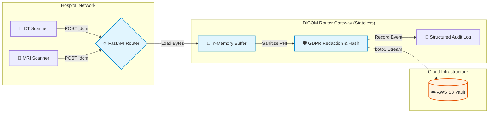
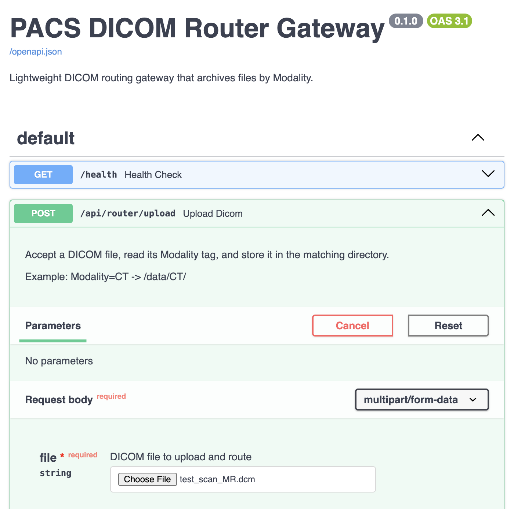
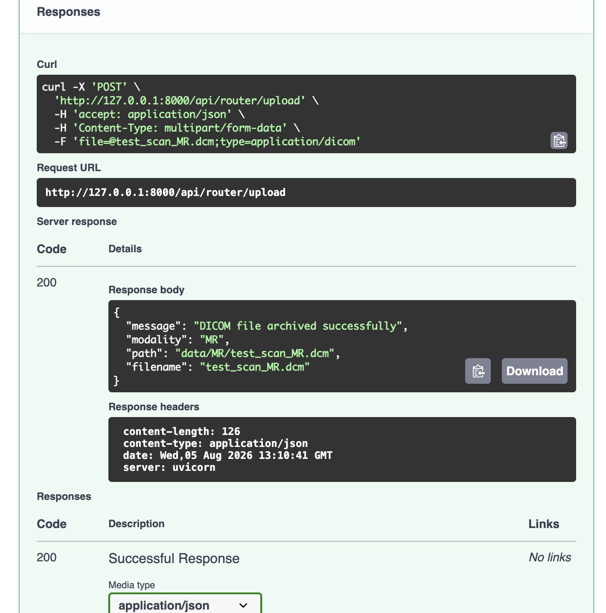
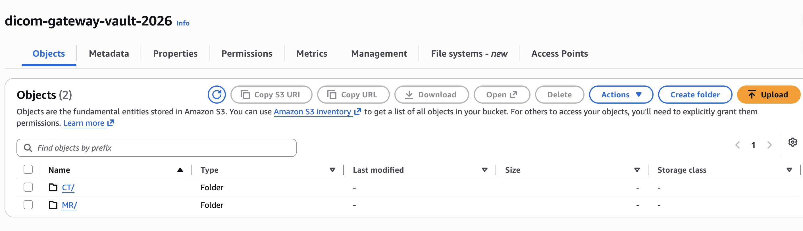
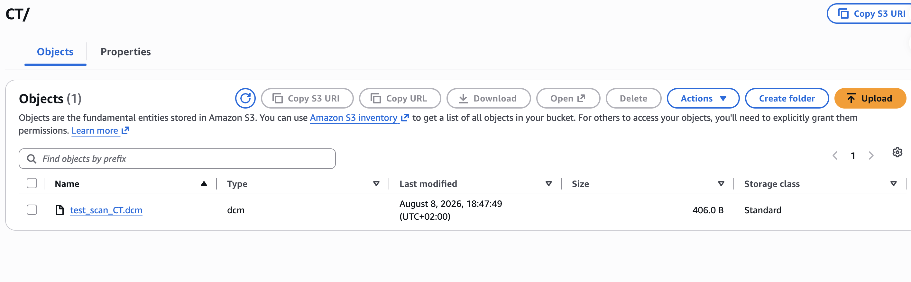

# 🏥 PACS DICOM Router Gateway (Cloud Edition)


DICOM Router is an enterprise-grade, production-ready backend microservice designed for automated medical imaging data ingestion and distribution in modern HealthTech architectures.

In a clinical environment, hospitals generate massive volumes of DICOM files across various modalities (CT, MRI, X-Ray). This gateway acts as a smart ingress node: it securely receives raw DICOM files via a RESTful API and parses the internal metadata using pydicom. Before any data leaves the memory buffer, the system strictly enforces GDPR-compliant PHI (Protected Health Information) redaction, pseudonymizing sensitive patient details on the fly.

Instead of relying on local disk storage, the gateway dynamically streams the sanitized data directly into categorized AWS S3 buckets based on their imaging Modality. By prioritizing data privacy and high-throughput cloud integration, this project bridges the gap between raw clinical data and downstream AI pipelines, demonstrating a strong focus on Healthcare IT standards, secure API design, and Cloud-native architecture.

## ✨ Enterprise-Grade Features

* **🛡️ GDPR-Compliant Pseudonymization**: 
  Implements strict PHI redaction before data leaves the memory buffer. `PatientName` and `DOB` are erased, while `PatientID` is pseudonymized using one-way SHA-256 hashing to maintain longitudinal data traceability without compromising patient identity.
* **☁️ Cloud-Native S3 Integration**: 
  Stateless architecture utilizing `io.BytesIO` for in-memory stream processing. DICOM payloads are piped directly to AWS S3 (`boto3`) without temporary local disk storage, maximizing I/O throughput and security.
* **📊 Observability & Audit Trails**: 
  Comprehensive structured JSON logging via `loguru`. Every upload, redaction event, and S3 transfer is meticulously logged with contextual metadata (IP, Modality, File Size, Hashed ID) for seamless integration with Datadog or AWS CloudWatch.
* **🤖 Automated CI/CD Pipeline**: 
  Fully tested using `pytest`. The CI pipeline runs on GitHub Actions, utilizing `unittest.mock` to simulate AWS S3 interactions, ensuring code reliability and preventing regression before deployment.

## 🛠️ Tech Stack

* **Core**: Python 3.10+, FastAPI, Uvicorn
* **Medical Imaging**: `pydicom`
* **Cloud Infrastructure**: AWS SDK (`boto3`)
* **DevOps & Testing**: `pytest`, GitHub Actions, `loguru`

## 🏗️ Architecture & Workflow



1.  **Ingress**: A client (e.g., a simulated PACS node) POSTs a .dcm file to /api/router/upload.
2.  **In-Memory Processing**: To ensure maximum I/O throughput and security, the FastAPI router reads the file directly into a memory buffer (io.BytesIO). No sensitive data is ever written to the local disk.
3.  **GDPR Sanitization**: The de-identification pipeline intercepts the dataset, strips direct identifiers (e.g., PatientName, DOB), and pseudonymizes the PatientID using a cryptographic SHA-256 hash.
4.  **Cloud Routing & Audit**: The sanitized dataset is streamed directly to an AWS S3 bucket, organized automatically by its Modality tag (e.g., /CT/...), while a structured JSON audit log is generated via loguru for observability.

## 🚀 Getting Started

### 1. Prerequisites
* **Docker** (Recommended for production-like deployment)
* *OR* **Python 3.10+** (For local development)
* **AWS Cloud Setup**: You need an active AWS account. Create an IAM User with `AmazonS3FullAccess` (or a more restricted custom policy) and generate Access Keys.

### 2. Environment Configuration
Create a `.env` file in the root directory (this file is git-ignored to prevent credential leaks):
```ini
AWS_ACCESS_KEY_ID=your_access_key
AWS_SECRET_ACCESS_KEY=your_secret_key
AWS_REGION=eu-north-1
S3_BUCKET_NAME=your-s3-bucket-name
```

### 3. Run the Gateway
### Option A: Run with Docker (Recommended)
Note: Docker will automatically read your .env file for AWS credentials.
Start the Uvicorn server:
```Bash
# 1. Build the Docker image
docker build -t dicom-router-gateway .

# 2. Run the container (mapping port 8000 and passing environment variables)
docker run --env-file .env -p 8000:8000 dicom-router-gateway
```
### Option B: Local Python Development Setup
```Bash
# 1. Create and activate a virtual environment
python3 -m venv .venv
source .venv/bin/activate  # On Windows use: .venv\Scripts\activate

# 2. Install dependencies
pip install -r requirements.txt

# 3. Start the FastAPI server
uvicorn main:app --reload --port 8000
```

### 📡 API Documentation & Usage
Once the server is running, the interactive Swagger UI is automatically available at: 👉 http://127.0.0.1:8000/docs

POST /api/router/upload
Uploads a .dcm file, performs in-memory PHI redaction, and routes it to the corresponding Modality folder in AWS S3.

Example Request (cURL):
```Bash
curl -X 'POST' \
  'http://localhost:8000/api/router/upload' \
  -H 'accept: application/json' \
  -H 'Content-Type: multipart/form-data' \
  -F 'file=@dummy_scan.dcm;type=application/dicom'
```
Success Response (200 OK):
```JSON
{
  "message": "DICOM file sanitized and securely routed to Cloud",
  "modality": "CT",
  "sanitized_patient_id": "8d969eef6ecad3c2",
  "cloud_location": "s3://your-s3-bucket-name/CT/scan_001.dcm",
  "filename": "scan_001.dcm"
}
```
 

### 🧪 Testing
The project uses pytest with extensive mocking (via unittest.mock) for cloud services to ensure tests run fast and remain isolated from actual network I/O or cloud costs.
```Bash
pytest -v
```

## 🎯 End-to-End Result



**Designed and engineered by Weijia Li.**
